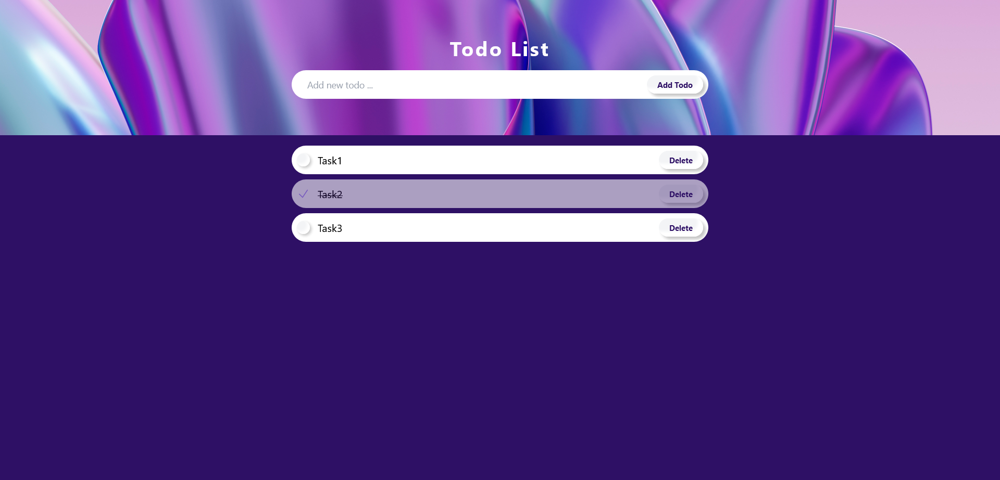

# Todo List App

## Table of contents

- [Overview](#overview)
- [How to run project](#how-to-run-project)
- [Screenshot](#screenshot)
- [Built with](#built-with)
- [What I learned](#what-i-learned)

### Overview

This is a mini project to learn redux-toolkit.
Fetch data and show them in a list, add ,delete, and toggle a note completed/uncompleted.

### How to run project

- npm install
- npm run dev
- npm run server

### Screenshot

### Built with

- [React](https://reactjs.org/) - JS library
- [tailwind](https://tailwindcss.com/) - For styles
- [axios](https://axios-http.com/) - For fetch data
- [json-server](https://www.npmjs.com/package/json-server) - For fake REST API
- [heroicons](https://heroicons.com/) - For svg
- Background image by <a href="https://www.freepik.com/free-photo/3d-rendering-holographic-layering_44958028.htm#query=glassmorphism%20background&position=16&from_view=search&track=ais&uuid=8ecadd8f-dda7-47be-bf06-849574ffc381">Freepik</a>

### What I learned

- How to work with redux-toolkit
